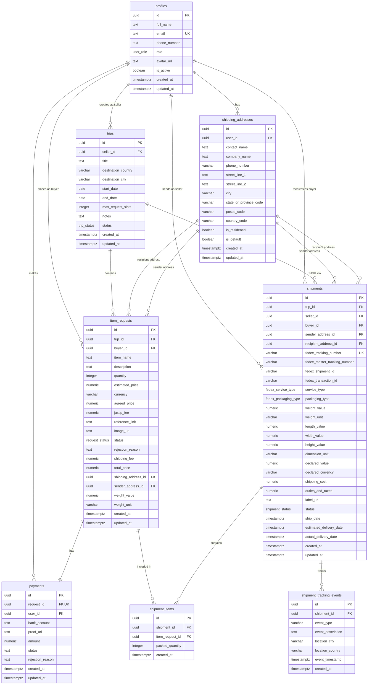

# Jastip

         


## Deskripsi
Platform untuk mempermudah proses jasa penitipan pembelian barang. Dengan memanfaatkan, web application untuk membantu dalam proses pencarian dan request barang yang ingin dititip untuk dibelikan oleh pihak yang sedang berada di negara lain. Pihak yang ingin menitip barang disebut sebagai `buyer`. Sedangkan pihak yang menerima request ini adalah `seller` atau juga bisa disebut sebagai shopper. Terdapat pula pihak `admin` yang dapat memantau website secara keseluruhan.


## Techstack
* Framework : Next.js 16, React 19
* Styling & UI: Tailwind CSS v4, shadcn/ui, Lucide React
* Backend & Auth: Supabase
* State & Validasi Zustand, Zod
* Fitur & Library Recharts (chart), Nodemailer (email), Fuse.js (search)
* Integrasi Eksternal: Frankfurter API (kurs mata uang)


## Menjalankan Project

1. Clone repository ini dan masuk ke direktori project.
    ```
    git clone https://github.com/nardaiv/jastip.git
    cd jastip
    ```
2. Install dependensi:
   ```bash
   npm i
   ```
3. Siapkan service yang digunakan untuk menjalankan project ini.
    - Fedex
        Buat akun fedex pada [developer.fedex.com](https://developer.fedex.com/wirc/browser/#/en-us/catalog), lalu buat `api project` dan simpan API key yang diberikan.

    - Supabase
        Buatlah project pada dashboard supabase kemudian simpan API key yang diberikan.

    - Gmail SMTP
        Sebelum mengaktifkan SMTP, pastikan bahwa akun gmail telah mengaktifkan 2fa. Lalu buka [myaccount.google.com](https://myaccount.google.com/) dan search `app password` lalu buatlah app password baru untuk SMTP ini (password ini digunakan sebagai SMTP_PASS pada environment key).

3. Masukan environment key untuk project ini ke  file `.env.local`:
   ```env
   NEXT_PUBLIC_SUPABASE_URL=
   NEXT_PUBLIC_SUPABASE_PUBLISHABLE_KEY=

   FEDEX_CLIENT_ID=
   FEDEX_CLIENT_SECRET=
   FEDEX_ACCOUNT_NUMBER=
   
   FEDEX_TRACKING_CLIENT_SECRET=
   FEDEX_TRACKING_CLIENT_ID=

   SMTP_USER=
   SMTP_PASS=
   ```

4. Setup database
    Buka project supabase, lalu click SQL EDITOR lalu jalankan command berikut untuk membuat table dan permission sesuai [struktur yang dibutuhkan](#schema-pada-database)

    <details>
    <summary>Command SQL</summary>

    ```sql
    -- 1. ENUMS
    CREATE TYPE public.fedex_packaging_type AS ENUM ('YOUR_PACKAGING', 'FEDEX_BOX', 'FEDEX_PAK', 'FEDEX_ENVELOPE', 'FEDEX_TUBE');
    CREATE TYPE public.fedex_service_type AS ENUM ('FEDEX_GROUND', 'FEDEX_EXPRESS_SAVER', 'STANDARD_OVERNIGHT', 'PRIORITY_OVERNIGHT', 'INTERNATIONAL_PRIORITY', 'INTERNATIONAL_ECONOMY', 'FEDEX_INTERNATIONAL_CONNECT_PLUS');
    CREATE TYPE public.request_status AS ENUM ('pending', 'verifying', 'accepted', 'rejected', 'purchased', 'delivered', 'cancelled', 'paid', 'shipped');
    CREATE TYPE public.shipment_status AS ENUM ('draft', 'label_created', 'pickup_scheduled', 'in_transit', 'out_for_delivery', 'delivered', 'exception', 'cancelled');
    CREATE TYPE public.trip_status AS ENUM ('draft', 'upcoming', 'active', 'completed', 'cancelled');
    CREATE TYPE public.user_role AS ENUM ('admin', 'seller', 'buyer');

    -- 2. TABLES
    CREATE TABLE IF NOT EXISTS public.profiles (
        id uuid PRIMARY KEY REFERENCES auth.users(id) ON DELETE CASCADE,
        full_name text NOT NULL,
        email text UNIQUE NOT NULL,
        phone_number text,
        role public.user_role DEFAULT 'buyer'::public.user_role NOT NULL,
        avatar_url text,
        is_active boolean DEFAULT true NOT NULL,
        created_at timestamptz DEFAULT now() NOT NULL,
        updated_at timestamptz DEFAULT now() NOT NULL
    );

    CREATE TABLE IF NOT EXISTS public.shipping_addresses (
        id uuid PRIMARY KEY DEFAULT gen_random_uuid(),
        user_id uuid NOT NULL REFERENCES public.profiles(id) ON DELETE CASCADE,
        contact_name text NOT NULL,
        company_name text,
        phone_number varchar(30) NOT NULL,
        street_line_1 text NOT NULL,
        street_line_2 text,
        city varchar(100) NOT NULL,
        state_or_province_code varchar(10),
        postal_code varchar(20) NOT NULL,
        country_code varchar(2) NOT NULL,
        is_residential boolean DEFAULT true NOT NULL,
        is_default boolean DEFAULT false NOT NULL,
        created_at timestamptz DEFAULT now() NOT NULL,
        updated_at timestamptz DEFAULT now() NOT NULL
    );

    CREATE TABLE IF NOT EXISTS public.trips (
        id uuid PRIMARY KEY DEFAULT gen_random_uuid(),
        seller_id uuid NOT NULL REFERENCES public.profiles(id) ON DELETE CASCADE,
        title text NOT NULL,
        destination_country varchar(100) NOT NULL,
        destination_city varchar(100),
        start_date date NOT NULL,
        end_date date NOT NULL,
        max_request_slots integer,
        notes text,
        status public.trip_status DEFAULT 'upcoming'::public.trip_status NOT NULL,
        created_at timestamptz DEFAULT now() NOT NULL,
        updated_at timestamptz DEFAULT now() NOT NULL,
        CONSTRAINT check_trip_dates CHECK (end_date >= start_date)
    );

    CREATE TABLE IF NOT EXISTS public.item_requests (
        id uuid PRIMARY KEY DEFAULT gen_random_uuid(),
        trip_id uuid NOT NULL REFERENCES public.trips(id) ON DELETE CASCADE,
        buyer_id uuid NOT NULL REFERENCES public.profiles(id) ON DELETE CASCADE,
        item_name text NOT NULL,
        description text,
        quantity integer DEFAULT 1 NOT NULL CHECK (quantity > 0),
        estimated_price numeric(12,2),
        currency varchar(3) DEFAULT 'IDR',
        agreed_price numeric(12,2),
        jastip_fee numeric(12,2),
        reference_link text,
        image_url text,
        status public.request_status DEFAULT 'pending'::public.request_status NOT NULL,
        rejection_reason text,
        created_at timestamptz DEFAULT now() NOT NULL,
        updated_at timestamptz DEFAULT now() NOT NULL,
        shipping_fee numeric DEFAULT 0,
        total_price numeric DEFAULT 0,
        shipping_address_id uuid REFERENCES public.shipping_addresses(id) ON DELETE SET NULL,
        sender_address_id uuid REFERENCES public.shipping_addresses(id) ON DELETE SET NULL,
        weight_value numeric,
        weight_unit varchar(10) DEFAULT 'KG'
    );

    CREATE TABLE IF NOT EXISTS public.payments (
        id uuid PRIMARY KEY DEFAULT gen_random_uuid(),
        request_id uuid NOT NULL UNIQUE REFERENCES public.item_requests(id) ON DELETE CASCADE,
        user_id uuid REFERENCES auth.users(id) ON DELETE SET NULL,
        bank_account text NOT NULL,
        proof_url text NOT NULL,
        amount numeric NOT NULL,
        status text NOT NULL DEFAULT 'pending' CHECK (status IN ('pending', 'approved', 'rejected', 'payment_rejected', 'paid')),
        rejection_reason text,
        created_at timestamptz DEFAULT now() NOT NULL,
        updated_at timestamptz DEFAULT now() NOT NULL
    );

    CREATE TABLE IF NOT EXISTS public.shipments (
        id uuid PRIMARY KEY DEFAULT gen_random_uuid(),
        trip_id uuid NOT NULL REFERENCES public.trips(id) ON DELETE CASCADE,
        seller_id uuid NOT NULL REFERENCES public.profiles(id) ON DELETE CASCADE,
        buyer_id uuid NOT NULL REFERENCES public.profiles(id) ON DELETE CASCADE,
        sender_address_id uuid REFERENCES public.shipping_addresses(id) ON DELETE SET NULL,
        recipient_address_id uuid REFERENCES public.shipping_addresses(id) ON DELETE SET NULL,
        fedex_tracking_number varchar(100) UNIQUE,
        fedex_master_tracking_number varchar(100),
        fedex_shipment_id varchar(100),
        fedex_transaction_id varchar(100),
        service_type public.fedex_service_type DEFAULT 'INTERNATIONAL_PRIORITY'::public.fedex_service_type NOT NULL,
        packaging_type public.fedex_packaging_type DEFAULT 'YOUR_PACKAGING'::public.fedex_packaging_type NOT NULL,
        weight_value numeric(8,2) NOT NULL CHECK (weight_value > 0),
        weight_unit varchar(5) DEFAULT 'KG' NOT NULL CHECK (weight_unit IN ('KG', 'LB')),
        length_value numeric(8,2),
        width_value numeric(8,2),
        height_value numeric(8,2),
        dimension_unit varchar(5) DEFAULT 'CM' CHECK (dimension_unit IN ('CM', 'IN')),
        declared_value numeric(12,2) DEFAULT 0.00 NOT NULL,
        declared_currency varchar(3) DEFAULT 'USD' NOT NULL,
        shipping_cost numeric(12,2),
        duties_and_taxes numeric(12,2),
        label_url text,
        status public.shipment_status DEFAULT 'draft'::public.shipment_status NOT NULL,
        ship_date timestamptz,
        estimated_delivery_date timestamptz,
        actual_delivery_date timestamptz,
        created_at timestamptz DEFAULT now() NOT NULL,
        updated_at timestamptz DEFAULT now() NOT NULL
    );

    CREATE TABLE IF NOT EXISTS public.shipment_items (
        id uuid PRIMARY KEY DEFAULT gen_random_uuid(),
        shipment_id uuid NOT NULL REFERENCES public.shipments(id) ON DELETE CASCADE,
        item_request_id uuid NOT NULL REFERENCES public.item_requests(id) ON DELETE CASCADE,
        packed_quantity integer DEFAULT 1 NOT NULL CHECK (packed_quantity > 0),
        created_at timestamptz DEFAULT now() NOT NULL,
        UNIQUE(shipment_id, item_request_id)
    );

    CREATE TABLE IF NOT EXISTS public.shipment_tracking_events (
        id uuid PRIMARY KEY DEFAULT gen_random_uuid(),
        shipment_id uuid NOT NULL REFERENCES public.shipments(id) ON DELETE CASCADE,
        event_type varchar(100) NOT NULL,
        event_description text NOT NULL,
        location_city varchar(100),
        location_country varchar(100),
        event_timestamp timestamptz NOT NULL,
        created_at timestamptz DEFAULT now() NOT NULL
    );

    -- 3. HELPER FUNCTIONS & TRIGGERS
    CREATE OR REPLACE FUNCTION public.get_auth_role() 
    RETURNS public.user_role
    LANGUAGE sql STABLE SECURITY DEFINER
    SET search_path = public
    AS $$
    SELECT role FROM public.profiles WHERE id = auth.uid();
    $$;

    CREATE OR REPLACE FUNCTION public.can_user_access_address(address_id uuid, current_user_id uuid) 
    RETURNS boolean
    LANGUAGE plpgsql SECURITY DEFINER
    SET search_path = public
    AS $$
    BEGIN
    RETURN EXISTS (
        SELECT 1 FROM public.shipping_addresses sa
        WHERE sa.id = address_id AND sa.user_id = current_user_id
    ) OR EXISTS (
        SELECT 1 FROM public.item_requests ir
        JOIN public.trips t ON ir.trip_id = t.id
        WHERE (ir.shipping_address_id = address_id OR ir.sender_address_id = address_id)
        AND t.seller_id = current_user_id
    );
    END;
    $$;

    CREATE OR REPLACE FUNCTION public.handle_new_user() 
    RETURNS trigger
    LANGUAGE plpgsql SECURITY DEFINER
    SET search_path = public
    AS $$
    DECLARE
    raw_role TEXT;
    assigned_role public.user_role;
    BEGIN
    raw_role := new.raw_user_meta_data->>'role';
    IF raw_role IN ('admin', 'seller', 'buyer') THEN
        assigned_role := raw_role::public.user_role;
    ELSE
        assigned_role := 'buyer'::public.user_role;
    END IF;

    INSERT INTO public.profiles (id, full_name, email, role)
    VALUES (
        new.id,
        COALESCE(NULLIF(new.raw_user_meta_data->>'full_name', ''), 'New User'),
        new.email,
        assigned_role
    )
    ON CONFLICT (id) DO NOTHING;

    RETURN new;
    END;
    $$;

    CREATE OR REPLACE TRIGGER on_auth_user_created
    AFTER INSERT ON auth.users
    FOR EACH ROW EXECUTE FUNCTION public.handle_new_user();

    -- 4. INDEXES
    CREATE INDEX IF NOT EXISTS idx_addresses_user_id ON public.shipping_addresses(user_id);
    CREATE INDEX IF NOT EXISTS idx_requests_buyer_id ON public.item_requests(buyer_id);
    CREATE INDEX IF NOT EXISTS idx_requests_status ON public.item_requests(status);
    CREATE INDEX IF NOT EXISTS idx_requests_trip_id ON public.item_requests(trip_id);
    CREATE INDEX IF NOT EXISTS idx_payments_request_id ON public.payments(request_id);
    CREATE INDEX IF NOT EXISTS idx_payments_user_id ON public.payments(user_id);
    CREATE INDEX IF NOT EXISTS idx_payments_status ON public.payments(status);
    CREATE INDEX IF NOT EXISTS idx_shipment_items_shipment ON public.shipment_items(shipment_id);
    CREATE INDEX IF NOT EXISTS idx_shipments_buyer_seller ON public.shipments(buyer_id, seller_id);
    CREATE INDEX IF NOT EXISTS idx_shipments_tracking_number ON public.shipments(fedex_tracking_number);
    CREATE INDEX IF NOT EXISTS idx_tracking_events_shipment ON public.shipment_tracking_events(shipment_id);
    CREATE INDEX IF NOT EXISTS idx_trips_seller_id ON public.trips(seller_id);
    CREATE INDEX IF NOT EXISTS idx_trips_status ON public.trips(status);

    -- 5. ENABLE ROW LEVEL SECURITY
    ALTER TABLE public.profiles ENABLE ROW LEVEL SECURITY;
    ALTER TABLE public.shipping_addresses ENABLE ROW LEVEL SECURITY;
    ALTER TABLE public.trips ENABLE ROW LEVEL SECURITY;
    ALTER TABLE public.item_requests ENABLE ROW LEVEL SECURITY;
    ALTER TABLE public.payments ENABLE ROW LEVEL SECURITY;
    ALTER TABLE public.shipments ENABLE ROW LEVEL SECURITY;
    ALTER TABLE public.shipment_items ENABLE ROW LEVEL SECURITY;
    ALTER TABLE public.shipment_tracking_events ENABLE ROW LEVEL SECURITY;

    -- 6. TABLE RLS POLICIES

    -- Profiles
    CREATE POLICY "Public profiles are readable" ON public.profiles FOR SELECT USING (is_active = true);
    CREATE POLICY "Users can update own profile" ON public.profiles FOR UPDATE TO authenticated USING (auth.uid() = id);
    CREATE POLICY "Admin full access to profiles" ON public.profiles USING (public.get_auth_role() = 'admin'::public.user_role);

    -- Shipping Addresses
    CREATE POLICY "Secure selective select on shipping_addresses" ON public.shipping_addresses FOR SELECT TO authenticated USING (public.can_user_access_address(id, auth.uid()));
    CREATE POLICY "Users can manage their own addresses" ON public.shipping_addresses USING ((auth.uid() = user_id) OR (public.get_auth_role() = 'admin'::public.user_role));

    -- Trips
    CREATE POLICY "Trips are readable by everyone" ON public.trips FOR SELECT USING (true);
    CREATE POLICY "Sellers can create trips" ON public.trips FOR INSERT WITH CHECK ((auth.uid() = seller_id) AND (public.get_auth_role() IN ('seller'::public.user_role, 'admin'::public.user_role)));
    CREATE POLICY "Sellers can update own trips" ON public.trips FOR UPDATE USING ((auth.uid() = seller_id) OR (public.get_auth_role() = 'admin'::public.user_role));

    -- Item Requests
    CREATE POLICY "View item requests" ON public.item_requests FOR SELECT USING ((auth.uid() = buyer_id) OR (auth.uid() IN (SELECT seller_id FROM public.trips WHERE trips.id = item_requests.trip_id)) OR (public.get_auth_role() = 'admin'::public.user_role));
    CREATE POLICY "Buyers can create item requests" ON public.item_requests FOR INSERT WITH CHECK ((auth.uid() = buyer_id) AND (public.get_auth_role() IN ('buyer'::public.user_role, 'admin'::public.user_role)));
    CREATE POLICY "Update item requests" ON public.item_requests FOR UPDATE USING ((auth.uid() = buyer_id) OR (auth.uid() IN (SELECT seller_id FROM public.trips WHERE trips.id = item_requests.trip_id)) OR (public.get_auth_role() = 'admin'::public.user_role));

    -- Payments
    CREATE POLICY "View payments policy" ON public.payments FOR SELECT TO authenticated USING (
    user_id = auth.uid() 
    OR public.get_auth_role() = 'admin'::public.user_role
    OR EXISTS (
        SELECT 1 FROM public.item_requests ir
        JOIN public.trips t ON ir.trip_id = t.id
        WHERE ir.id = payments.request_id AND t.seller_id = auth.uid()
    )
    );
    CREATE POLICY "Insert payments policy" ON public.payments FOR INSERT TO authenticated WITH CHECK (
    user_id = auth.uid() 
    OR EXISTS (SELECT 1 FROM public.item_requests ir WHERE ir.id = payments.request_id AND ir.buyer_id = auth.uid())
    );
    CREATE POLICY "Allow update access for admins" ON public.payments FOR UPDATE TO authenticated USING (
    public.get_auth_role() = 'admin'::public.user_role
    );

    -- Shipments
    CREATE POLICY "View shipments" ON public.shipments FOR SELECT USING ((auth.uid() = seller_id) OR (auth.uid() = buyer_id) OR (public.get_auth_role() = 'admin'::public.user_role));
    CREATE POLICY "Sellers create and update shipments" ON public.shipments USING (((auth.uid() = seller_id) AND (public.get_auth_role() = 'seller'::public.user_role)) OR (public.get_auth_role() = 'admin'::public.user_role));

    -- Shipment Items
    CREATE POLICY "Allow users to view their own shipment items" ON public.shipment_items FOR SELECT TO authenticated USING (EXISTS (SELECT 1 FROM public.shipments s WHERE s.id = shipment_items.shipment_id AND (s.seller_id = auth.uid() OR s.buyer_id = auth.uid())));
    CREATE POLICY "Allow sellers and buyers to insert shipment items" ON public.shipment_items FOR INSERT TO authenticated WITH CHECK (EXISTS (SELECT 1 FROM public.shipments s WHERE s.id = shipment_items.shipment_id AND (s.seller_id = auth.uid() OR s.buyer_id = auth.uid())));

    -- Shipment Tracking Events
    CREATE POLICY "View tracking events" ON public.shipment_tracking_events FOR SELECT USING (EXISTS (SELECT 1 FROM public.shipments s WHERE s.id = shipment_tracking_events.shipment_id AND (s.buyer_id = auth.uid() OR s.seller_id = auth.uid())) OR (public.get_auth_role() = 'admin'::public.user_role));

    -- 7. STORAGE BUCKETS (Private by Default for Sensitive Data)
    INSERT INTO storage.buckets (id, name, public, avif_autodetection, file_size_limit, allowed_mime_types)
    VALUES 
    ('request_upload', 'request_upload', false, false, NULL, NULL),
    ('item-requests', 'item-requests', false, false, NULL, NULL),
    ('payment-proofs', 'payment-proofs', false, false, NULL, NULL),
    ('avatars', 'avatars', true, false, NULL, NULL)
    ON CONFLICT (id) DO UPDATE SET 
    public = EXCLUDED.public,
    file_size_limit = EXCLUDED.file_size_limit,
    allowed_mime_types = EXCLUDED.allowed_mime_types;

    -- 8. STORAGE RLS POLICIES

    -- Avatars (Public Read, Owner Manage)
    CREATE POLICY "Public Read Avatars" ON storage.objects FOR SELECT TO public USING (bucket_id = 'avatars');
    CREATE POLICY "Upload Own Avatar" ON storage.objects FOR INSERT TO authenticated WITH CHECK (bucket_id = 'avatars' AND auth.uid()::text = owner::text);
    CREATE POLICY "Delete Own Avatar" ON storage.objects FOR DELETE TO authenticated USING (bucket_id = 'avatars' AND auth.uid()::text = owner::text);

    -- Item Requests Bucket (Private: Visible to Buyer, Assigned Seller, and Admin)
    CREATE POLICY "Insert Item Request Images" ON storage.objects FOR INSERT TO authenticated WITH CHECK (bucket_id IN ('item-requests', 'request_upload'));
    CREATE POLICY "Read Item Request Images" ON storage.objects FOR SELECT TO authenticated USING (
    bucket_id IN ('item-requests', 'request_upload') AND (
        auth.uid()::text = owner::text
        OR public.get_auth_role() = 'admin'::public.user_role
        OR EXISTS (
        SELECT 1 FROM public.item_requests r
        JOIN public.trips t ON r.trip_id = t.id
        WHERE (r.image_url LIKE ('%' || storage.objects.name) OR r.buyer_id = auth.uid()) 
            AND (t.seller_id = auth.uid() OR r.buyer_id = auth.uid())
        )
    )
    );
    CREATE POLICY "Manage Own Item Request Images" ON storage.objects FOR ALL TO authenticated USING (
    bucket_id IN ('item-requests', 'request_upload') AND (
        auth.uid()::text = owner::text OR public.get_auth_role() = 'admin'::public.user_role
    )
    );

    -- Payment Proofs Bucket (Private: Only Buyer and Admin can access)
    CREATE POLICY "Upload Payment Proofs" ON storage.objects FOR INSERT TO authenticated WITH CHECK (
    bucket_id = 'payment-proofs'
    );
    CREATE POLICY "Read Payment Proofs" ON storage.objects FOR SELECT TO authenticated USING (
    bucket_id = 'payment-proofs' AND (
        auth.uid()::text = owner::text 
        OR public.get_auth_role() = 'admin'::public.user_role
        OR EXISTS (
        SELECT 1 FROM public.payments p
        WHERE p.proof_url LIKE ('%' || storage.objects.name)
            AND (p.user_id = auth.uid() OR public.get_auth_role() = 'admin'::public.user_role)
        )
    )
    );

    ```
    </details><br>


5. Run project dengan:
   ```bash
   npm run dev
   ```
   Aplikasi akan berjalan di [http://localhost:3000](http://localhost:3000).


## Schema pada Database

* Database Tables: 

    `profiles` (pengguna & role), `trips` (perjalanan seller), `item_requests` (permintaan titipan), `payments` (pembayaran), `shipping_addresses` (alamat kirim), `shipments`/`shipment_items` (data pengiriman), dan `shipment_tracking_events` (riwayat pelacakan).

* Storage Buckets:
    
     `avatars` (foto profil), `request-photos` (foto barang titipan), dan `payment-proofs` (bukti bayar).




## Kontribusi

| Anggota   | Pembagian Tugas   |
| :------------ | :------------ |
|  Faachir |  Membuat page untuk create trip dan merepons request buyer bagi role seller & integrasi dengan API currency frankfurt.dev |
| Hanif  | Membuat  page untuk creating request, list trip bagi role buyer  |
|  Narda |  Membuat dashboard admin dan integrasi |
